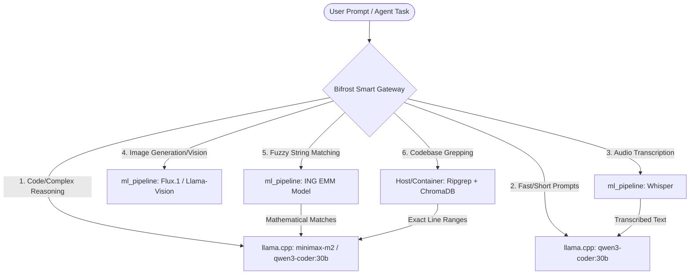

# 🌌 Lario Local AI Workstation — Architectural Master Plan

This document serves as the **absolute source of truth** and architectural blueprint for your AMD Strix Halo Local AI Workstation. It outlines the long-term orchestration goals of your stack and provides a **"Sense Check" Verification Checklist** you can run at any time to verify exactly what is running in Docker versus your host machine.

---

## 🏛️ The Core Philosophy: "Specialized Offloading"

The ultimate goal of this workstation is **maximum hardware efficiency through specialized orchestration**. Rather than throwing every raw task at a single massive Language Model, the system functions as a smart dispatcher.



---

## 🧠 Specialized Routing Workflows

### 1. Code Refactoring & Search Split (surgical editing)
* **Phase 1 (Search):** When the `lario` CLI needs to search or refactor, the broad search is offloaded to **ripgrep (`rg`)** and **ChromaDB vector space**. This scans thousands of files in milliseconds and returns *only* the matching paths, line numbers, and 2-line snippets.
* **Phase 2 (Reasoning):** The CLI parses these line ranges and sends *only* the targeted code lines to **Llama 3.3 70B** or **Qwen 2.5 32B** for surgical refactoring. This keeps the VRAM footprint minimal and maximizes generation speed.

### 2. Audio Tasks (Whisper)
* **Workflow:** Any voice inputs or audio file transcripts bypass the LLM reasoning layer entirely and are routed to the containerized **Whisper** engine inside the `ml_pipeline` container. 
* **Outcome:** The highly accurate transcribed text is then piped back into your active agent workspace.

### 3. Design & Image Generation (Flux.1 / Llama-Vision)
* **Workflow:** UI design reads, image understandings, or landing page graphics generation are routed to **Llama-3.2-Vision** or **Flux.1-schnell** inside the GPU-passthrough containers.
* **The "Surgical Eyes" tool (`visual_inspect.py`):** Rather than letting the coding agent automatically inspect the UI on every cycle (which wastes RAM and creates infinite refactoring loops), we have built a surgical inspection tool `/workspace/visual_inspect.py`:
  1. Whenever the `lario` CLI completes a UI edit, it can run:
     ```bash
     ./visual_inspect.py /workspace/index.html
     ```
  2. The script headlessly launches **Chromium** inside the container to capture a pixel-perfect screenshot in less than a second.
  3. It base64-encodes the screenshot and dispatches it to **Llama-3.2-Vision:latest** on your GPU via Bifrost.
  4. Llama-Vision returns exact layout alignment audits, color contrast reviews, and Tailwind refactoring suggestions back to the CLI terminal, allowing Qwen to surgically fix the code!
  5. *Optional Mockup Comparison:* You can pass a Figma/design mockup image to compare the rendering against the spec:
     ```bash
     ./visual_inspect.py /workspace/index.html --mockup /workspace/mockup.png
     ```

### 4. High-Performance String Matching (ING EMM)
* **Workflow:** Fuzzy matches or master client data reconciliation are dispatched to the containerized, GPU-accelerated **ING EMM string-matching model** inside the `ml_pipeline` container. The raw mathematical matches and confidence scores are returned, allowing Llama 3.3 or Qwen to quickly format them into an elegant markdown report.

---

## 🔍 The "Sense Check" Verification Checklist

Run these quick terminal commands on your **host machine** at any time to verify the true state of your local AI workstation. **Never be fooled by ghost configurations!**

### Step 1: Is Docker actually running the AI Stack?
Run this to see if the containers are active:
```bash
docker ps --format "table {{.Names}}\t{{.Status}}\t{{.Ports}}"
```
**Expected Output (You should see all 9 containers active):**
* `lario-dev-proxy` (Running on port `80`)
* `lario-dev-ubuntu` (Running on port `8441`)
* `lario-dev-pop` (Running on port `8440`)
* `lario-dev-mint` (Running on port `8442`)
* `ml_pipeline` (Active in background)
* `rag_api` (Running on port `8100`)
* `bifrost` (Running on port `8080`)
* `llamacpp` (Running on port `11434`; llama-swap → llama.cpp, network alias `ollama`)
* `chromadb` (Running on port `8000`)

*If the table is empty or missing these names, your Docker stack is NOT running.*

---

### Step 2: Are the Host Ports mapped correctly?
Verify which ports are listening on your host:
```bash
sudo ss -tulpn | grep -E "8080|11434|8000|8100"
```
**Expected Output:**
* Port `8080` (Bifrost Gateway) must be listening under `docker-proxy`.
* Port `11434` (llama.cpp / llama-swap API) must be listening under `docker-proxy`.
* Port `80` (Nginx Proxy) must be listening under `docker-proxy`.

*If you see the native processes (like a host-level `ollama` process) instead of `docker-proxy`, then your host-level services are clashing with the Docker stack!*

---

### Step 3: Is Host OpenCode/Lario Routing Locally?
Test if your host's CLI tools are successfully talking to the local Bifrost gateway instead of the cloud:
```bash
curl -s http://localhost:8080/v1/models | grep -q "qwen3-coder" && echo "Local Routing: OK (Bifrost Active)" || echo "Local Routing: FAILED"
```
And verify that the CLI actually executes locally:
```bash
lario run "test" --pure
```
*(If it starts up immediately, prints a response, and shows no payment warnings, it is fully local and free!)*

---

### Step 4: Is AMD GPU Passthrough Working?
Check that the `llamacpp` container sees the AMD Strix Halo GPU via ROCm:
```bash
docker run --rm --device /dev/kfd --device /dev/dri lario/llamacpp:latest llama-server --list-devices
#   Available devices:
#     ROCm0: AMD Radeon Graphics (65536 MiB, … free)
```
*(No `ROCm0` device → GPU isn't passed through. Check `/dev/kfd` + `/dev/dri` and `docker-compose.override.yml`.)*

The most reliable check is real throughput — a 30B model generates at tens of tok/s on GPU, single-digit on CPU:
```bash
curl -s http://localhost:11434/v1/models | jq -r '.data[].id'    # served model ids
docker logs llamacpp 2>&1 | grep -iE 'rocm|offload'              # GPU offload on model load
# qwen3-coder:30b benchmarks ~75 tok/s on the iGPU.
```
If generation is single-digit tok/s, the model loaded on CPU — recheck the passthrough above and that
`HSA_OVERRIDE_GFX_VERSION=11.0.2` is set (baked into the image + `docker-compose.override.yml`). To
recreate the backend:
```bash
cd /mnt/Shared/personal/lario-llms && docker compose up -d --build llamacpp
```
See `llama-cpp/README.md` for the full backend setup and `docs/strix_halo_fedora_setup.md` for host GPU drivers.

---

## 🛠️ Automated Setup Management

The entire stack is configured to start automatically on system boot via a systemd user-level service.

* **Check Autostart Status:**
  ```bash
  systemctl --user status lario-ai.service
  ```
* **Verify Lingering (Headless boot without logging in):**
  ```bash
  ls /var/lib/systemd/linger/lario
  ```
  *(If this file exists, lingering is enabled and the stack will boot up the moment the machine turns on.)*
